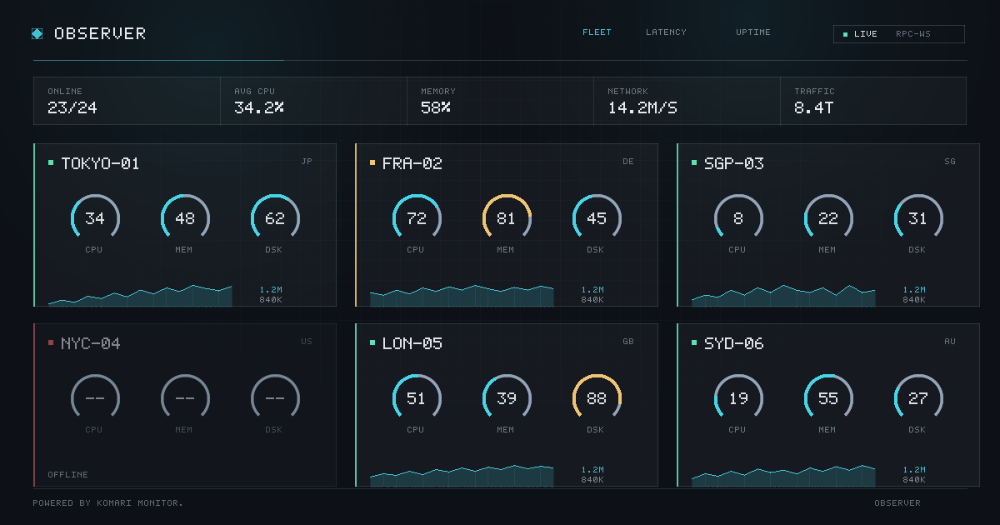

# Observer

A futuristic, minimalist theme for [Komari Monitor](https://github.com/komari-monitor/komari).

Deep-space HUD palette, instrument typography, GSAP motion, custom backgrounds,
and a transport ladder that degrades gracefully when the connection gets rough.



---

## Install

### From the theme market (recommended — self-updating)

Observer publishes its own **theme market source**, so your instance can install
and update it without anyone downloading a ZIP. Needs Komari **1.3.0+**, which is
where the built-in theme market landed.

In Komari: **Settings → Themes → Market → Sources → Add**, then:

| Field | Value |
| --- | --- |
| Name | `Observer` |
| URL | `https://raw.githubusercontent.com/Redstonexs/komari-observer-theme/main/v1.json` |

Observer now appears in the market list. When a new version is released the
catalog updates within a few minutes and the panel offers the upgrade; installing
it replaces the theme in place. Your saved theme settings are stored in a
separate table and survive the upgrade.

Three things worth knowing:

- A theme is only installable once its **release exists**. The catalog carries a
  download URL pinned to a release tag; publish `v1.json` before cutting that
  release and the market lists Observer but fails the install with
  `HTTP status 404`. `pnpm catalog:check` fetches every advertised package and
  re-hashes it for exactly this reason, and CI runs it on every push.
- Komari **caches a source for 10 minutes**. Right after a release, use the
  market's refresh control if the new version is not showing yet.
- The server re-hashes the downloaded package and refuses to install it unless
  the digest matches the catalog, so a tampered or truncated download fails
  closed rather than installing.

### From a file

1. Download `komari-theme-observer.zip` from the [releases page](../../releases).
2. In Komari: **Settings → Themes → Upload**, then set Observer as the active theme.
3. Configure it in the same panel — every option below is exposed there.

Requires Komari **1.0.5+** for theme configuration and **1.0.7+** for the richest
data transport; older servers fall back automatically. The theme market needs
**1.3.0+**.

---

## What it does

**Views** — card grid, dense sortable table, and a compact mode for large fleets,
over a dot-matrix world map of where the fleet actually lives.

**Per-node health** — latency and availability are properties of a node, not of a
fleet, so each detail page carries its own probe-latency chart and status-page
availability strip alongside CPU / memory / network / load / GPU history. The
cross-node latency and uptime pages remain for comparing nodes against each
other.

**Custom backgrounds** — a built-in aurora, starfield or instrument grid needing
no hosted asset, or your own image or video with independent light/dark sources,
blur, and a signed overlay control. Visitors can override the background for
themselves if you allow it.

**Motion** — a GSAP boot timeline, staggered card entrance, Flip-animated
sorting, DrawSVG gauge sweeps and chart draw-ons, and a pulse when a value moves
sharply. All of it honours `prefers-reduced-motion`, and `prefers-contrast: more`
independently strips the decorative layers.

**Legibility over an arbitrary wallpaper** — an adaptive scrim sits behind the
UI, muted text and chart strokes are lifted in dark mode, and status is never
encoded by colour alone.

---

## Connection handling

> **Komari has no Server-Sent Events endpoint.** This is worth stating plainly
> because it is not obvious: there is no `text/event-stream` route anywhere in
> the server, and neither of Komari's WebSockets actually pushes. `/api/clients`
> blocks on a read and answers exactly one frame per `get` it receives, and
> `/api/rpc2` is strict request/response. Every "live" Komari dashboard,
> including the official one, is polling — the pipe is just a socket.

Observer treats transports as a ladder and steps down automatically:

| Tier | Transport | Endpoint |
| --- | --- | --- |
| 1 | WebSocket | `/api/rpc2` → `common:getNodesLatestStatus` (richest payload; needs 1.0.7+) |
| 2 | WebSocket | `/api/clients` (works on every version) |
| 3 | EventSource | your `sse_endpoint`, if you set one — **see below** |
| 4 | HTTP POST | `/api/rpc2` (survives proxies that break upgrades) |
| 5 | HTTP GET | `/api/recent/:uuid` fan-out (last resort for old servers) |

Health is measured by **data freshness, not socket state**. Komari sets no read
deadline, no write deadline and no ping handler on its browser sockets, so a
half-open connection reports `readyState === OPEN` forever while delivering
nothing — the browser's own view of the connection is actively misleading.
Observer demotes after two missed replies or three reconnect flaps in a minute,
retries with jittered exponential backoff, never permanently gives up while the
tab is visible, and climbs back to tier 1 after a minute of clean running. The
header badge shows which tier is live.

### The SSE tier

Tier 3 is real, complete code that is **dormant on a stock install**, because
there is nothing to connect to. If you run an SSE bridge in front of Komari, put
its URL in the `sse_endpoint` setting and Observer will slot it into the ladder
ahead of HTTP polling. It accepts either a uuid-keyed map of flat records or a
relayed `/api/clients` frame.

---

## Development

```bash
pnpm install
cp .env.example .env.local     # point VITE_API_TARGET at a real Komari server
pnpm dev                       # http://localhost:5273
```

The dev server proxies `/api` (including WebSocket upgrades) and `/themes` to
your backend, and serves the repo's `komari-theme.json` at
`/themes/observer/komari-theme.json` so the admin settings form renders.

### No Komari to hand? Use the mock

`scripts/mock-server.mjs` is a dependency-free stand-in for Komari's public API,
so you can develop and test without an install:

```bash
pnpm mock                      # http://127.0.0.1:25774, 12 fake nodes
pnpm dev
```

It reproduces the behaviours that actually shape the client — the `get`-only
WebSocket protocol, blanked report UUIDs, the CPU floor of 0.01, online-ness
living in a separate array, the two incompatible record shapes, negative ping
values meaning packet loss, and the `load_type=gpu` 400.

It can also break specific transports so the fallback ladder can be exercised
for real:

```bash
pnpm mock -- --break rpc2-ws                # expect the badge to drop to WS
pnpm mock -- --break rpc2-ws,clients-ws     # expect it to drop to RPC·HTTP
pnpm mock -- --flaky                        # drop sockets every ~12s
```

If the WebSocket refuses to connect during development, it is Komari's
post-[GHSA-q355-h244-969h](https://github.com/advisories/GHSA-q355-h244-969h)
origin check. Fix it server-side (`ws_allowed_origins`, or
`KOMARI_WS_DISABLE_ORIGIN=true`) — never by hardcoding a host in the client.

### Build and package

```bash
pnpm build      # -> dist/
pnpm verify     # check the package contract
pnpm package    # -> komari-theme-observer.zip
pnpm catalog    # -> v1.json, hashed from that ZIP
```

`pnpm verify` guards the failure modes that are silent at build time and only
appear once installed: the three literal sentinels Komari string-replaces in
`index.html`, asset names beginning with `_` (Go's `embed` ignores those),
relative asset paths, a stripped GSAP licence banner, and manifest/settings
drift. CI runs it before any release is cut.

`pnpm catalog` regenerates the market source. Tagging `v*` does the whole thing
for you — sync the version, build, verify, package, publish the release, then
commit `v1.json` back to `main` **after** the asset exists, so a subscribed
instance never sees a catalog pointing at a download that is not there yet. The
generator refuses to emit an entry that Komari would reject, and validates the
one rule with no server-side error message worth reading: the catalog `version`
must equal the version inside the packaged manifest, or the install aborts with
only "does not match".

`scripts/make-catalog.mjs` derives the repo slug from `komari-theme.json`'s
`url`, so a fork publishes its own source by changing that one field.

`scripts/make-preview.mjs` regenerates `preview.png` from the palette. Replace it
with a real screenshot of your own fleet when you have one.

---

## Licence

This theme's own source is under the licence in [LICENSE](LICENSE).

The built output bundles **GSAP**, which is under the GSAP Standard
"No Charge" License (© Webflow) — **not** MIT, and not sublicensable by this
repository. See [THIRD-PARTY-NOTICES.md](THIRD-PARTY-NOTICES.md) before
redistributing or forking.

"Powered by Komari Monitor." in the footer is required by Komari's theme
guidelines. Please leave it.
